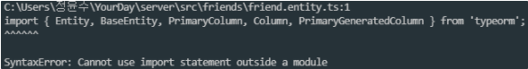

## 에러 발생 (Cannot use import statement outside a module)

- 간단히 고칠 수 있는 문제지만, 자주 발생하는 에러이기 때문에 기록하였다.
- 해당 에러가 발생하면, 대부분 entity 경로 문제이다.
    



## 기존 코드

```jsx
import { Module } from '@nestjs/common';
import { UsersModule } from './users/users.module';
import { TypeOrmModule } from '@nestjs/typeorm';
// import { typeORMConfig } from './configs/typeorm.config';
import { AuthModule } from './auth/auth.module';
import { FriendsModule } from './friends/friends.module';
@Module({
  imports: [
    TypeOrmModule.forRoot({
      type: 'mysql',
      host: 'localhost',
      port: 3306,
      username: 'root',
      password: 'password',
      database: 'user_db',
      entities: [__dirname + '/../**/*.entity.{js,ts}'],
      synchronize: true,
    }),
    UsersModule,
    AuthModule,
    FriendsModule,
  ],
})
export class AppModule {}
```

## 해결 코드

정상적으로 import 되게끔 만들어 놓은, entity에 따라 DB가 구성되었다!


참고: [https://burning-camp.tistory.com/69](https://burning-camp.tistory.com/69)
