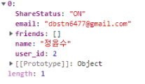

# 비동기 형식 접근(Promise)

### 기존 코드

```jsx
//friends.controller.ts
import { Body, Controller, Get, Post, Req } from '@nestjs/common';
import { FriendsService } from './friends.service';
import { Friend } from './friend.entity';
import { CreateFriendDto } from './dto/create-friend.dto';
import { User } from '../users/user.entity';
import { UsersService } from '../users/users.service';
import { map } from 'rxjs';

@Controller('friends')
export class FriendsController {
    constructor(
        private friendService: FriendsService,
        private usersService: UsersService,
        ) {}

        @Post('/')
        createFriend(@Body() name): any {
            const foundUser = this.usersService.getUserInfo("정윤수");
            console.log(foundUser);
            return foundUser;
        }
}

// @GetUser() user:User
```

브라우저에서 버튼을 눌렀을 때, 아래 함수가 작동하도록 설계했다. 위 서버 코드에서 전달해주는 User 정보를 브라우저에서는 데이터가 정상적으로 출력 된다. 하지만, 전달 해주기 전, 서버에서도 그 데이터를 확인하려 했는데, 아래와 같은 형태로 출력이 됨을 알 수 있었다.

```jsx
const handleFriendRequest = async () => {
    setRequest("send");
    console.log("send");
    //친구 요청
    await axios.post('http://localhost:3001/friends', {name: requestTo} ,{})
    .then((e) => {
      console.log(e.data);
    })
  };
```

참고: this.usersService.getUserInfo() 를 호출하면, 특정 유저의 정보를 얻을 수 있다.


### 출력 형태


- pending 상태의 Promise 배열이 제공됨을 알 수 있다.

### 

[Promise 공식문서](https://developer.mozilla.org/ko/docs/Web/JavaScript/Reference/Global_Objects/Promise)

참고: [https://joyful-development.tistory.com/20](https://joyful-development.tistory.com/20)

### 해결 코드: 비동기 형식 접근

- 따라서, pending 상태의 Promise들을 실행시켜주기 위해 비동기 형식으로 접근을 시도한다.

```jsx
...
@Post('/')
  createFriend(@Body() name): any {
    const foundUser = this.usersService.getUserInfo('정윤수');
    foundUser
      .then((e) => {
        console.log(e);
        return e;
      })
      .catch((err) => {
        console.log(err);
        return err;
      });
  }
...
```

## 출력 방법

```jsx
@Post('/')
  createFriend(@Body() name): any {
    const foundUser = this.usersService.getUserInfo('정윤수');
    foundUser
      .then((user) => {
        user.forEach(info => {
            console.log(`create: ${JSON.stringify(info.name)}`);
        });
        // return this.friendService.createFriend("정윤수", e);
      })
      .catch((err) => {
        console.log(err);
        return err;
      });
  }
```

### 또 만난 오류

- 유저 정보는 성공적으로 얻어와서, 이를 DB에 성공적으로 저장되는지, 테스트를 하려 했다. 하지만, createFriendDto 내의 name객체가 아무 값도 가지지 않는다는 오류가 떴다.
    - 유저의 정보는 잘 가져왔기 때문에, 이상한 일이었다.
    - 실제로 확인해보니, 정말 undifiend가 떠서 당황했다.
    


와 같은 에러가 발생하여 찾은 유저 정보를 한번더 확인해보니, undefined가 발생했다.


```jsx
//friends.repository.ts
import { EntityRepository, Repository } from 'typeorm';
...

@EntityRepository(Friend)
export class FriendRepository extends Repository<Friend> {
    

    async createFriend(username: string,
        createFriendDto: User,
    ): Promise<Friend> {
        const { name } = createFriendDto;

        const friend = this.create({
            name,
            user: createFriendDto,
        });
        await this.save(friend);
        return friend;
    } 
}
```

```jsx
//friends.service.ts
import { Injectable, Body } from '@nestjs/common';
...

@Injectable()
export class FriendsService {
    constructor(
        @InjectRepository(FriendRepository)
        private friendRepository: FriendRepository,
    ){}

    createFriend(username: string,
        createFriendDto: User,
    ): Promise<Friend> {
        return this.friendRepository.createFriend(username, createFriendDto);
    }
}
```

```jsx
//friends.controller.ts
import { Body, Controller, Get, Post, Req } from '@nestjs/common';
...

@Controller('friends')
export class FriendsController {
  constructor(
    private friendService: FriendsService,
    private usersService: UsersService,
  ) {}

  @Post('/')
  createFriend(@Body() name): any {
    const foundUser = this.usersService.getUserInfo('정윤수');
    foundUser
      .then((user) => {
        console.log(`찾은 유저 정보: ${JSON.stringify(user.name)}`);
        //return this.friendService.createFriend("정윤수", user);
      })
      .catch((err) => {
        console.log(err);
        return err;
      });
  }
}
```

특정 유저의 데이터 성공적으로 가져온다. 원인은 해당 데이터에 대한 접근 방법이였다. 때문에 아래와 같이 .forEach()로 데이터에 접근하여 데이터에 성공적으로 접근 할 수 있었다. 내일은 map()과 forEach()의 차이점은 뭐가 있을지 배워봐야겠다.

### 해결 코드

```
@Post('/')
  createFriend(@Body() name): any {
    const foundUser = this.usersService.getUserInfo('정윤수');
    foundUser
      .then((user) => {
        user.forEach((info) =>
          console.log(`찾은 유저 정보: ${info.name}`),
        );
        // return this.friendService.createFriend("정윤수", e);
      })
      .catch((err) => {
        console.log(err);
        return err;
      });
  }
```


